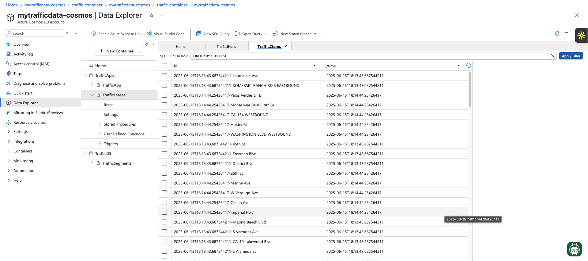
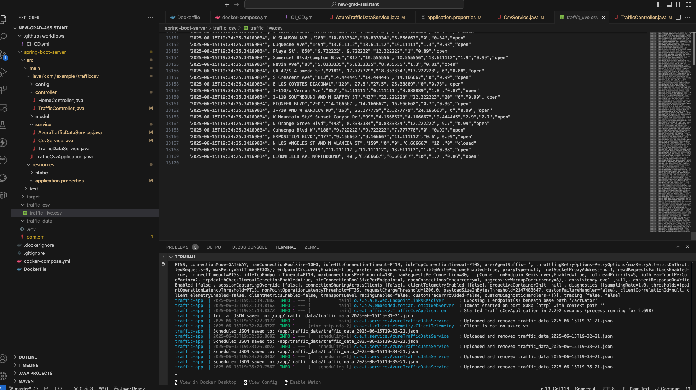
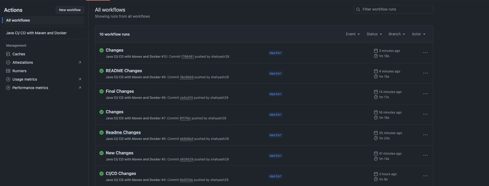
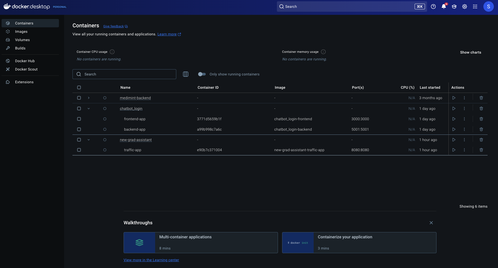

# Traffic Analytics Service <br>

This service ingests traffic flow data from the HERE Traffic API, saves the raw JSON locally, and uses Azure Cosmos DB to store and process the data. It automatically uploads each JSON file in bulk to Cosmos DB and cleans up local files afterwards. <br>

## Features

Real‑time ingestion: Fetches JSON files from a local directory every minute. <br>
Bulk upload: Uses Azure Cosmos DB bulk operations for high‑throughput ingestion. <br>
Automatic cleanup: Deletes local JSON files on successful upload. <br>
Resilient scheduling: On startup and then every minute, the service scans and processes pending files. <br>
Data integrity: Sanitizes document IDs to avoid illegal characters. <br>

## Prerequisites <br>

Java 23  <br>
Maven <br>
Azure Cosmos DB account with a database and container <br>
HERE API key for traffic flow data <br>

## Installation <br>

Clone the repository: <br>

git clone https://github.com/your-org/traffic-analytics-service.git <br>
cd traffic-analytics-service <br>

## Configure environment variables (create a .env or set in your environment): <br>

HERE_API_KEY=your_here_api_key <br>
AZ_COSMOS_URI=https://<your-account>.documents.azure.com:443/ <br>
AZ_COSMOS_KEY=<your_cosmos_key> <br>
TRAFFIC_DATA_DIR=./traffic_data <br>
TRAFFIC_CSV_DIR=./traffic_csv <br>

## Build the project: <br>

mvn clean package -DskipTests <br>
Configuration <br>
Update your application.properties (or .env) with: <br>

## Local directories <br>
traffic.data.dir=${TRAFFIC_DATA_DIR} <br>

## Cosmos DB bulk upload settings <br>

azure.cosmos.uri=${AZ_COSMOS_URI} <br>
azure.cosmos.key=${AZ_COSMOS_KEY} <br>
azure.cosmos.database=<your_database_name> <br>
azure.cosmos.container=<your_container_name> <br>
Ensure the local traffic_data directory exists or will be created on startup. <br>
Running Locally <br>
java -jar target/traffic-analytics-service-0.0.1-SNAPSHOT.jar <br>
On startup, the service will process any existing JSON files in traffic_data/. It then schedules scans every 60 seconds to ingest new files. <br>

## Running the Dockerized Service

Since our GitHub Actions pipeline automatically builds and pushes a new `latest` image on every merge to `master`, anyone can run the most up-to-date version with just a few commands: <br>

1. **Install Docker**  <br>
   Make sure Docker is installed and running on your machine. <br>

2. **Pull the latest image**  <br>
   ```bash <br>
   docker pull your-dockerhub-username/traffic-app:latest <br>

mkdir -p "$(pwd)/traffic_data" <br>

## Run the container: <br>

docker run -d \ <br>
  -e AZ_COSMOS_URI=$AZ_COSMOS_URI \ <br>
  -e AZ_COSMOS_KEY=$AZ_COSMOS_KEY \ <br>
  -e TRAFFIC_DATA_DIR=/app/traffic_data \ <br>
  -v $(pwd)/traffic_data:/app/traffic_data \ <br>
  traffic-analytics-service <br>

## CI/CD <br>

A sample GitHub Actions workflow is provided in .github/workflows/ci-cd.yml. It builds the JAR, builds & pushes the Docker image, and tags releases. <br>

How It Works <br>
AzureTrafficDataService <br>
On application startup and then every minute, it scans traffic_data/ for *.json files. <br>
For each file, reads the JSON payload and extracts the traffic flow array. <br>
Sanitizes segment descriptions to create valid Cosmos DB document IDs. <br>
Uses CosmosAsyncContainer.executeBulkOperations to upsert documents in bulk. <br>
Deletes the local file with Files.deleteIfExists(...). <br>

## TrafficSegment <br>
A simple POJO representing a traffic segment with id, time, description, and traffic metrics. <br>
Error handling <br>
Skips malformed JSON. <br>
Logs failures to process individual files or items without stopping the service.<br>

## Here are some diagrams illustrating how the code functions end-to-end <br>

 <br>

 <br>

## Please find attached screenshots of my GitHub Actions workflows in action. <br>

 <br>

## And here’s the Docker image as it appears in Docker Hub, ready to be pulled and run: <br>

